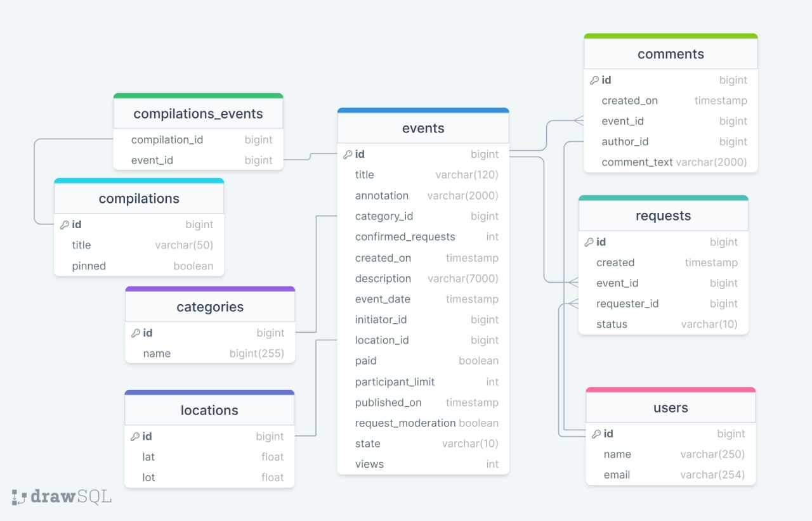
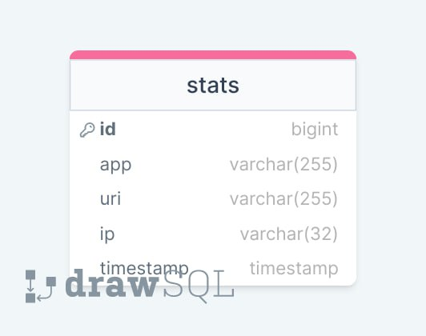

# java-explore-with-me

__Цель:__ Итоговый (дипломный) проект по окончанию обучения по курсу Java-разработчик на Yandex Практикуме.

__Идея проекта:__ Свободное время — ценный ресурс. Ежедневно каждый планирует как его потратить — куда и с кем сходить. 
Сложнее всего в таком планировании поиск информации и переговоры. Нужно учесть много деталей: какие намечаются мероприятия, 
свободны ли в этот момент друзья, как всех пригласить и где собраться.
Написанное приложение — афиша, в которой можно предложить какое-либо событие от выставки до похода в кино и собрать
компанию для участия в нём.

__Краткое описание:__ Проект с микросервисной архитектурой написан на языке Java с использованием Spring Boot фреймворка, Jpa(Hibernate), 
объектно-реляционной базы данных PostgreSQL.

## Технологии
- Java 11
- Spring Boot
- JPA
- Hibernate
- Lombok
- PostgreSQL
- Maven

## Приложение состоит из двух сервисов
1. Основной сервис (main-service)
Содержит основную логику работы приложения и разделен на части по уровням доступа:
•	публичная будет доступна без регистрации любому пользователю сети;
•	закрытая будет доступна только авторизованным пользователям;
•	административная — для администраторов сервиса.
2. Сервис статистики (stats-service)
Хранит количество просмотров и позволяет делать различные выборки для анализа работы приложения.

## Возможности

### Пользователи 
Для администраторов:
- Создать пользователя
- Найти пользователей по списку указанных id пользователей
- Подписаться на пользователя

### Категории событий
Для администраторов:
- Создать категорию
- Удалить категорию
- Обновить категорию

Для всех пользователей:
- Найти категорию по id
- Получить список категорий

### События
Для зарегистрированных пользователей:
- Добавить событие
- Найти список событий, созданных пользователем
- Найти событие пользователя по id
- Обновить информацию о событии, созданном пользователем
- Получить список заявок на событие, созданное пользователем
- Одобрить или отклонить заявки из списка для определённого события 

Для всех пользователей:
- Поиск событий по задаваемым параметрам
- Поиск опубликованного события по id

Для администраторов:
- Поиск событий по разным параметрам
- Обновление события

## Заявки на участие в событии
Для зарегестрированных пользователей:
- Создать заявку
- Получить список своих заявок пользователем
- Отклонить заявку

## Подборки событий
Для администраторов:
- Создать подборку
- Обновить подборку
- Удалить подборку

Для всех пользователей:
- Найти подборку по id
- Получить список подборок

## Комментарии
Для администраторов:
- Удалить комментарий по id

Для зарегистрированных пользователей:
- Создать комментарий (только для участника или инициатора события)
- Удалить собственный комментарий
- Обновить собственный комментарий

Для всех пользователей:
- Получить комментарии к определенному событию по id событию

## Схема базы данных основного сервиса:

## Схема базы даннных сервиса статистики:

## Запуск  приложения
- Командой «docker-compose up» (Для запуска через докер);
- С помощью IntelliJ IDEA:  
Main-service: main-service\src\main\java\ru\practicum\mainservice\MainServiceApp -> "run";   
Stats-service: stats-service\stats-server\src\main\java\ru\practicum\statsserver\StatsServerApplication -> "run"
